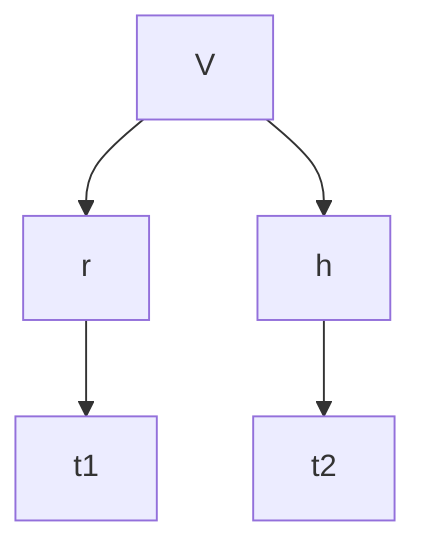

Review of the web assign practice for the mid term review

## Vectors stuff

We are given:

$$x^2 + y^2 = 64$$

$$z = x^ - y^2$$

Find the curve of intersection

standard parameterization of a circle of radius 8

$$x = 8\cos t$$

$$y = 8\sin t$$

once we have the first 2, the third comes for free

$$z = 64 \cos^2t - 64\sin^2t$$

*alternatively*

$$\vec{r}(t) = \langle 8\cos t,8\sin t,64\cos 2t \rangle$$

we use the cosine double angle here

$$\cos(2t) = \cos^2t - \sin^2t$$

$$z = 64\cos(2t)$$

### another problem example

$$x^2 + y^2 = 36$$

$$z = xy$$

vector

$$\vec{r}(t) = \langle 6\cos t, 6\sin t, 18\sin(2t) \rangle$$

## Curvature practice

e/trig problem

$$\vec{r}(t) = \langle e^t\cos t, e^t\sin t,3t \rangle$$

find the curvature at point (1,0,0)

we need to find the value of t that corresponds to this point

t=0 is a good example

curvature equations that we need:

$$K = \frac{|\vec{r}' \times \vec{r}''|}{|\vec{r}'|^3}$$

$$K = |\vec{r}''(\partial)|$$

$$K = | \frac{dT}{d\partial} |$$

$$K = \frac{|\vec{T}'|}{|\vec{r}'|}$$

plugging in for $\vec{r}'$

$$\vec{r}' = \langle e^t\cos t-e^t\sin t, e^t\sin t+e^t\cos t, 3 \rangle$$

$$= \langle e^t ( \cos t-\sin t), e^t (\sin t + \cos t), 3$$

$$\vec{r}' = \langle e^t(\cos t-\sin t)+e^t(-\sin t-\cos t), e^t(\sin t+\cos t) + e^t(\cos t-\sin t),0 \rangle$$

$$= \langle e^t (\cos t - \sin t - \sin t -\cos t), e^t(\sin t+\cos t+\cos t+\sin t), 0$$

$$= \langle -2e^t\sin t,2e^t\cos tt,0 \rangle$$

$$r'(0) = \langle 1,1,3 \rangle$$

$$r''(0) = \langle 0,2,0 \rangle$$

$$|\vec{r}'(0)| = \sqrt{ 1+1+9 } = \sqrt{ 11 }$$

$$\vec{r}' \times \vec{r}'' = \begin{bmatrix}
i & j & k\\
1 & 1 & 3 \\ 
0 & 2 & 0
\end{bmatrix} = \langle-6,0,2 \rangle$$

$$|\vec{r}' \times $$

## Polar Coordinates Problem

Find the area in the top right quadrant and outside of the smaller circle

$$x^2 + y^2 = 16, \ \ \ x^2 +y^2 = 4x$$

on desmos:

> [!Info] Desmos
> <iframe src="https://www.desmos.com/calculator/aj9wwbqagm" width=600 height="400" ></iframe>

we can get r from the point of intersection

$$r = 4\cos \theta$$

settin up the double integral:

$$\int \int_{\mathcal{D}} x dA = \int_{0}^{\frac{\pi}{2}} \int _{4\cos \theta}^4 r^2 \cos \theta \ dr \ d\theta$$

$$I_{1}: \ \ \ \left. \frac{r^3}{3}\cos \theta \right|_{4\cos \theta}^4$$

$$\frac{64}{3}\cos \theta - \frac{64}{3}\cos^4 \theta$$

$$\int_{0}^{\frac{\pi}{2}} \frac{64}{3} \cos \theta - \frac{64}{3} \cos^4 \theta \ d\theta$$

$$\frac{64}{3} - \frac{64}{3}\int_{0} ^ \frac{\pi}{2} \cos^4 \theta \ d\theta$$

$$\frac{64}{3} - \frac{64}{3} \int \left( \frac{1+\cos  2 \theta}{2} \right)^2 \ d\theta$$

$$\frac{64}{3} - \frac{16}{3} \int_{0}^ \frac{\pi}{2} (1+\cos 2 \theta)^2 \ d\theta$$

## Tangent Planes / Normal Lines Problem

$$x + y + z = 3e^{xyz}$$
Find the tangent plane and normal line at the point (0,0,3)

write as a function

$$f(x,y,z) = x+y+z-3e^{xyz}$$

do chain rule and make into a vector

$$\nabla f = \left. \langle 1 - 3yze^{xyz}, 1-3xze^{xyz}, 1-3xye^{xyz} \rangle \right|_{(0,0,3)}$$

$$\nabla f = \langle 1,1,1 \rangle$$

$$\langle 1,1,1 \rangle \cdot \langle x-0, y-0, z-3 \rangle = 0$$

$$x+y+z-3=0$$

### Equation of the tangent plane of this 

$$\nabla f \cdot \nabla r = 0$$

**this is usefull on test**

$$\frac{x-0}{1}=\frac{y-0}{1} = \frac{z-0}{1}$$

## random practice i forgot 

$$r_{1} = 1.2$$

$$h_{1}=-2.8$$

$$v_{1} = ? \ when \ r=135, h =186$$

$$V = \frac{\pi r^2 h}{3}$$

chain rule problem

$$V_{t} = V_{r}r_{t}+V_{h}h_{t}$$

$$$$
