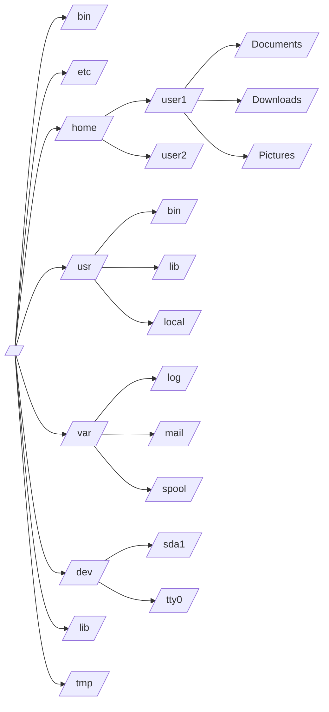
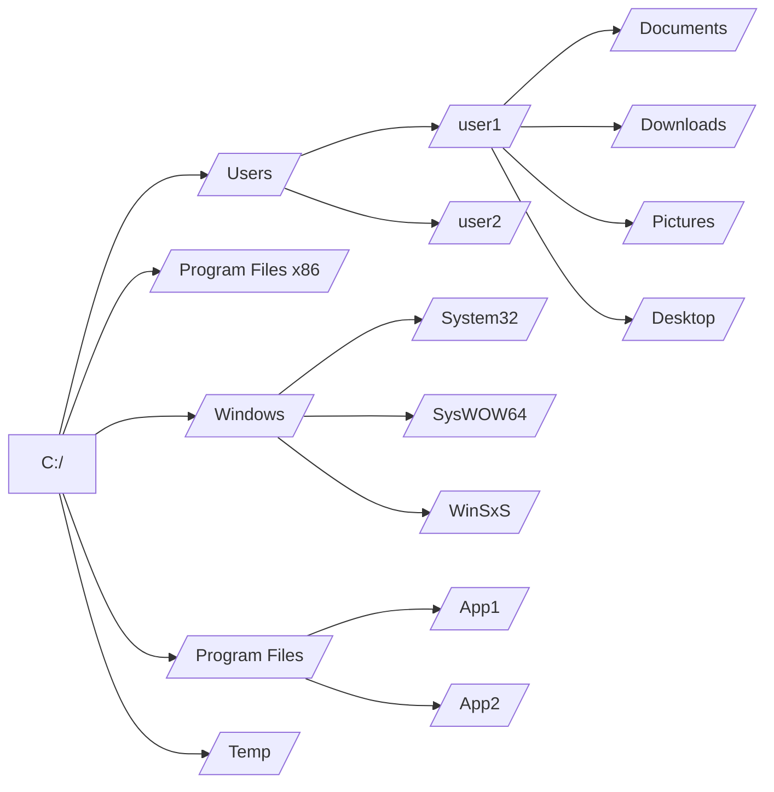

> [!abstract] Student Information
> Ewan Pedersen
> CS2210
> 9 • 11 • 2024
 
---

## 1.  What takes place when formatting a microSD card (or any drive)?


When formatting a SD or microSD card, all the data on the device beforehand gets wiped. After all data on the card is wiped, a new file system is put in place, something like **Fat32** or **exFAT**, which determines how memory is allocated on the card. The standards can depend on your operating system, like how **Windows** uses **Fat32**[^1].

> [!info] 
> Unlike fully erasing the card, reformatting is actually good for the health of your SD, and is a good thing to do routinely. This is because while erasing fully writes over the information, causing wear on the transistors inside, reformatting does not actually "erase" the data as per se, but instead replaces the master file table, so the data just becomes unusable due to the new file system in place.

Once the master file table is replaced and process complete, you should have a fully refreshed card on a new file system.

--- 

## 2. What is a file system? Provide examples of two along with a comparison of them. What file system does Windows 11 use? macOS?

Distinguishing from the file systems used for formatting drives, **Operating System File Systems** serve as the organization of the users' data into folders. This controls things like where your Downloads go, but also low level things like where temp files are stored and where the OS binaries are stored. But beyond the visual organization of your files, your File System also controls how file permissions are handled, and many other features like Symbolic Linking and more[^2].

### Unix File System

MacOS and most Linux distros use the **Unix** file system, coined by the Unix Operating System. This file system is great because by being around for a long time, it allows people to take it as a standard and not have to deal with updates/edge cases. Unix File System is also well known for its security and permissions management system[^3].

**Example File Tree of a Unix File System:**


### Windows File System

Windows, on the other hand, uses the **New Technology File System**(NTFS). While it isn't as mature as the Unix File System, NTFS offers numerous features that make it a good choice, like encryption, high performance, and other advantages[^4].

**Example Diagram of the Windows File System:**



---

## 3. Which file system does _Raspberry Pi OS_ use?

Since the Raspberry Pi runs on Rasbian, a fork of Debian, Linux, it uses the Unix File System like most other Linux computers.

---

## 4. What is a partition? Can you have multiple partitions on the same storage device with different file systems on each partition?

A partition is separated section of a storage disk, except that the OS views it as its own, separate disk. Partitions are great when you want to completely isolate different files/programs from each other, like creating a dual boot system.

> [!danger] Warning
> While they are useful, disk partitioning can be very dangerous if not done correctly, and you could loose your drive's data

Partitions also serve to make your storage safer, as by creating a logical barrier between the two, there is no way for files from one partition to cross over or interact with the other. This can be used to separate things like user and system data, so that if the system data becomes full, the full system is still usable[^5].

---

## 5. What is SSH? Describe.

**SSH**, also known as the Secure Shell Protocol, is command line tool and important protocol for secure communication across computers through a network.

While SSH can be used for all sorts of things like terminal web apps(shown below), it is mostly used in today's world for securely logging in to servers and other headless devices.

![[Attachments/Screenshot 2024-09-11 at 10.12.33 PM.png]]
*SSH being used to buy coffee via `terminal.shop`*

In our case, we use it to log into currently headless raspberry pi, which allows us to do just about anything we want with it that you could do through a Graphical User Interface.

### Usage

SSH can be used in the following way:

```bash
# get your username - not always the one for other systems, but will work on your system
whoami

# get your machine hostname - for ssh'ing onto your own machine
hostname

# connecting to a machine - need to know the user and hostname
ssh username@hostname

# examplle
ssh ewan@ewanpi.local
```

---

## SSH Into Pi - Screenshot

This was me connecting to my Rasberry Pi 5, but I did the same thing for the Pi 4 as well.

![[Screenshot 2024-09-11 at 10.26.21 PM.png]]

---

## Works Cited

[^1]: https://www.youtube.com/watch?v=ShFMghqLSQI
[^2]: https://www.geeksforgeeks.org/file-systems-in-operating-system/
[^3]: https://www.geeksforgeeks.org/unix-file-system/
[^4]: https://www.techtarget.com/searchwindowsserver/definition/NTFS#:~:text=NTFS%2C%20which%20stands%20for%20NT,%2Dstate%20drives%20(SSDs).
[^5]: https://en.wikipedia.org/wiki/Disk_partitioning